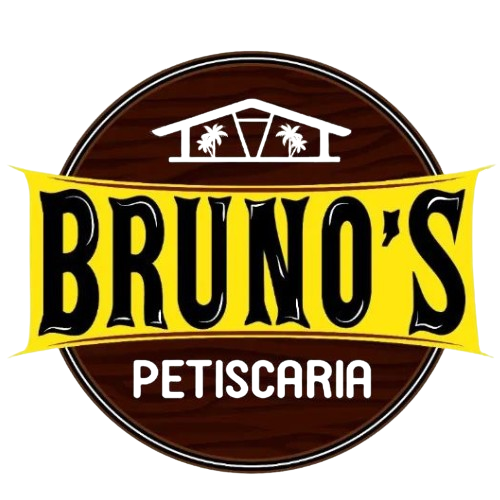
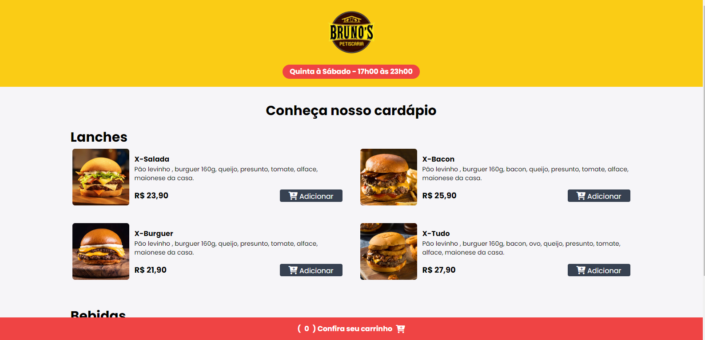
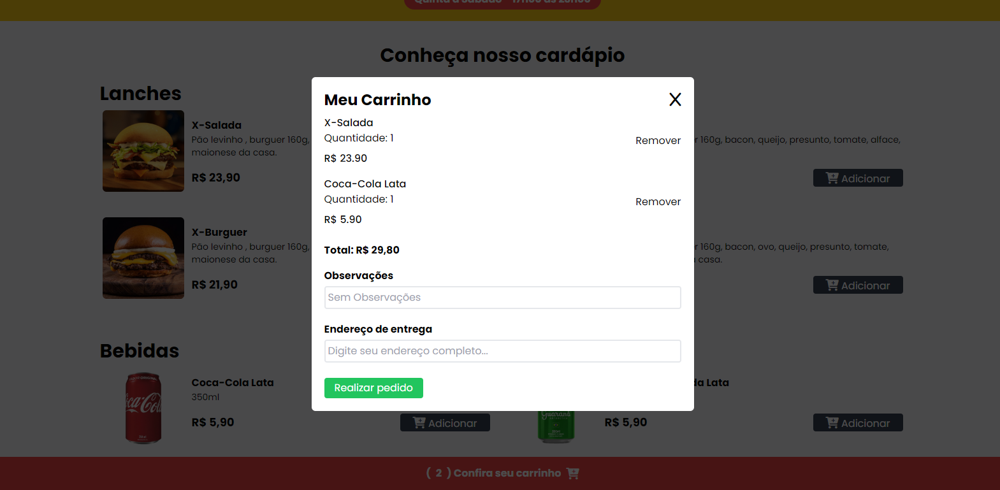

# Projeto Bruno's Petiscaria - Pedidos
 
Página formato cárdapio com carrinho para realizar pedidos 
[Click aqui para conferir](https://projeto-brunos-cardapio.vercel.app/)

## Índice
- <a href="#sobre-o-projeto">📖 Sobre o Projeto </a>
- <a href="#layout-do-projeto">🖥️ Layout do Projeto </a>
- <a href="#tecnologias-utilizadas">💾 Tecnologias Utilizadas </a>
- <a href="#funcionalidades-do-projeto">🧰 Funcionalidades do Projeto </a>
- <a href="#proximos-passos">🔗 Próximos Passos </a>
- <a href="#autor-do-projeto">✏️ Autor do Projeto </a>

## 📖 Sobre o Projeto 
Este projeto é destinado a um restaurante onde havia a necessidade do cliente realizar pedidos sem muita complexidade. Foi criado então uma página como cardápio e carrinho onde ao realizar o pedido com seu endereço o cliente é direcionado a uma nova mensagem no WhatsApp do estabelecimento contendo seu pedido, observações e endereço de entrega. Simples e eficiente !

## 🖥️ Layout do Projeto 
Layout Principal:

Layout do Modal Carrinho:

## 💾 Tecnologias Utilizadas 
- Figma
- HTML
- CSS - Tailwind
- JavaScript
- Toastify
- Fontawesome
- API WhatsApp

## 🧰 Funcionalidades do Projeto 
- [x] Imagens com valor e descrição dos produtos.
- [x] Carrinho para poder adicionar 1 ou mais itens.
- [x] Validação de horário de funcionamento.
- [x] Validação do campo endereço digitado para realizar pedido.
- [x] API WhatsApp integrada para realizar o pedido via mensagem.

## 🔗 Próximos Passos 
- [] Implementar API própria com banco de dados local junto ao sistema de pedidos.
- [] Desenvolver página para fácil manutenção do cardápio, como alteração de valor, descrição, adicionar ou retirar produtos.
- [] Implementar alteração para Dark Mode.

## ✏️ Autor do Projeto 
### João Carlos Alves Junior

LinkedIn: 
[https://www.linkedin.com/in/joaocajr/](https://www.linkedin.com/in/joaocajr/)

E-mail: 
jotacalves@hotmail.com
